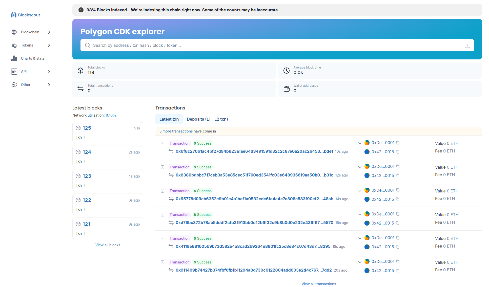
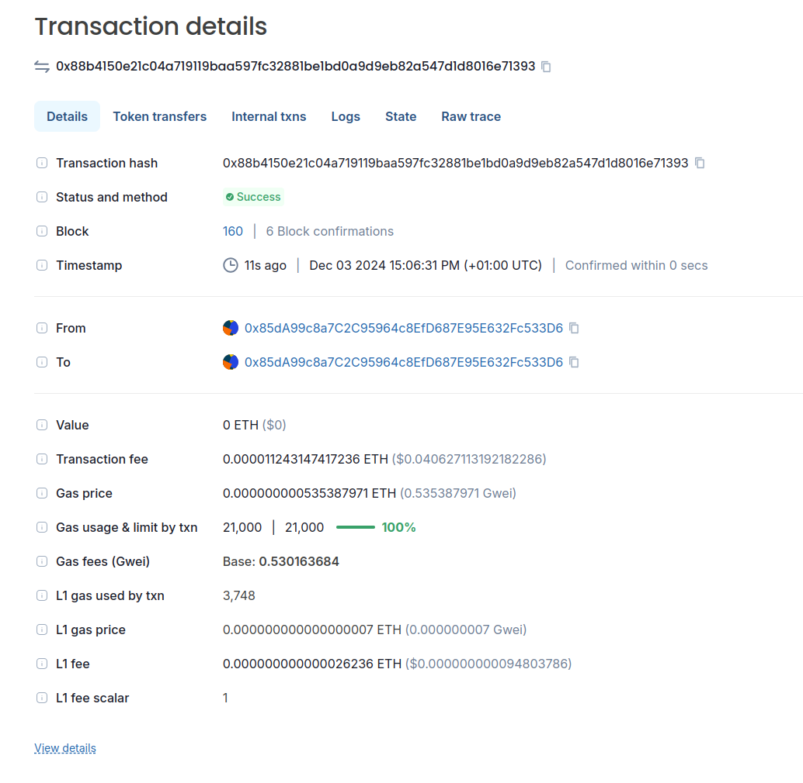

# Polygon CDK/zkEVM Blockscout Package
This is a Kurtosis based stack to deploy Blockscout on arbitrary OP based chain.

## Configuration
Be sure to have Kurtosis installed on you computer: https://docs.kurtosis.com/install/

Create a params.yaml with config params
### Required params
- rpc_url: RPC URL
- ws_url: WS URL

### Optional params
- blockscout_public_port: port on which you'll have Blockscout frontend available, 8000 by default
- blockscout_public_ip: public ip if you want to expose blockscout for remote access
- blockscot_backend_port: if you want to expose blockscout to be accessed remotely (you've set blockscout_public_ip), you need to set a port for backend as well

- trace_url: RPC URL with debug endpoints enabled, rpc_url will be used if omitted
- chain_id: l2 chain id, if omitted it will be automatically determined through rpc_url
<!-- - swap_url: URL for swap, will just enable a button link on the top right -->
- l1_explorer: explorer URL for L1 network
- l1_rpc_url: RPC URL for L1
- deployment_suffix: specific for kurtosis, will append this suffic to all services


### Example usage
```bash
#!/bin/bash
ENCLAVE_NAME="blockscout"
KURTOSIS_ARGS='{
    "rpc_url": "http://34.175.121.98:8545",
    "ws_url": "ws://34.175.121.98:8546",
    "chain_id": 23456,
    "l1_sysconfig_addr": "0xcd5baacc94686159001ab7f02843c4f2b4b213c5",
    "l1_opportal_addr": "0x86ab5f2b74b94afa5940621e444c7af4cb033e11",
    "block_time": 6,
    "l1_batchinbox_addr": "0x0079397cb6bfbeecfa48b0e3e503bf712fe0d7e6",
}'
kurtosis run --enclave $ENCLAVE_NAME github.com/xavier-romero/kurtosis-blockscout-op "$KURTOSIS_ARGS"
```

# Sample screenshots



